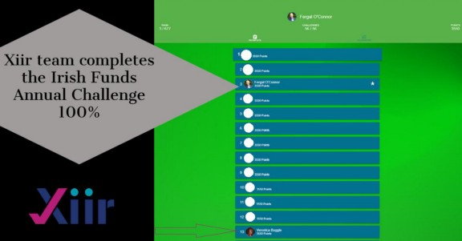

> Global Funds Conference

We are continuing to capture some highlights of the Xiir start-up journey during our initial publications on medium.

As winner of the recent Irish Funds Fintech Factor, Xiir was generously awarded a booth at the Irish Funds Annual Global Conference, October 2021.

([IRISH  FUNDS](www.irishfunds.ie))

Hope you like how we summed up the Annual Global Funds Conference. Our quick ([video ](https://vimeo.com/512282168)) shows how busy we were at our Fintech Factor booth.

We also participated here in the annual conference challenge.

A big shout out to Veronica who managed to complete all 56 tasks in time during last week’s Irish Funds Global Conference Annual Challenge.

Only the top 16 names on the Challenge Leaderboard entered the annual draw. We were thrilled that all her efforts paid off with one of the runner up prizes.

And especially as Veronica, an Intern student, came onboard to gain industry experience with the Xiir marketing team only two weeks previously.

We also took second place in the challenge but the “luck of the Irish” ran out in securing further prizes for our efforts. If we can have a Xiir booth at the 2021 Irish Funds Annual Conference we will target top of the ladder in the challenge.

