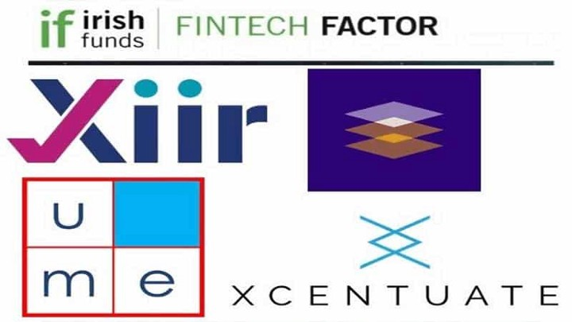

We are continuing to capture some highlights of the Xiir start-up journey during our initial publications on medium.

Xiir won the recent Irish Funds Fintech Factor.

We definitely were both thrilled and honoured and why wouldn’t we be.

Our prize was a valuable booth at the Annual Global Irish Funds 2020 Conference, over two days on October 21st and 22nd.

https://www.irishfunds.ie/events/irish-funds-annual-global-funds-conference-2020

The theme for 2020 conference was “Embracing New Perspectives” and the agenda contained thought-provoking content covering a number of key areas in the funds industry, including the response to Covid-19, the challenge of Brexit, sustainability and ESG, regulation, FinTech and AI, funds distribution, cybersecurity, and the future of work.

And how we got there.

We were in a highly competitive field with other innovative startups companies, so winning Fintech Factor was no way a certainty. We put in a huge amount of preparation work in advance of the event. And luckily this paid dividend.